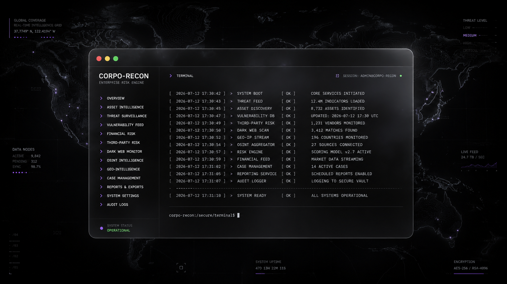
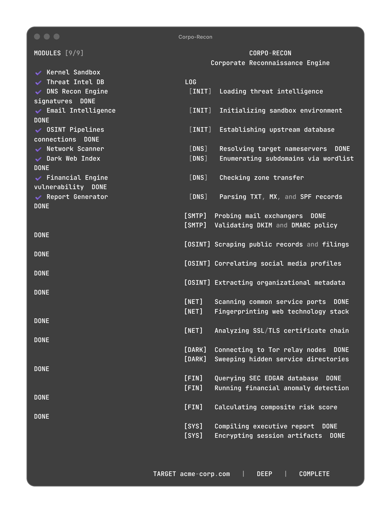

<div align="center">

  <!-- ═══════════════════════════════════════════════════════════════ -->
  <!--                        HERO BANNER                            -->
  <!-- ═══════════════════════════════════════════════════════════════ -->

  

  <br><br>

  <h1>C O R P O — R E C O N</h1>
  <p><i>Advanced Corporate Reconnaissance & Financial Risk Engine</i></p>

  <br>

  
  &nbsp;
  
  &nbsp;
  
  &nbsp;
  

  <br><br>

  <code>Asynchronous. Monochromatic. Methodical.</code>

</div>

<br>

---

<br>

## 🛡️ &nbsp; The Overview

**Corpo-Recon** is a terminal-native corporate reconnaissance platform engineered for elite red teams, security researchers, and financial risk analysts operating in high-stakes environments. It combines passive open-source intelligence gathering with deep-web financial anomaly detection — executing the entire pipeline through a strictly monochromatic, state-machine driven CLI.

The interface is not decorative. There are no chaotic hex dumps, no scrolling waterfalls of unreadable data. Every operation is structured as a sequential telemetry log: each task is dispatched, executed, and confirmed before the next begins. Operators maintain a clear tactical picture at all times.

Built on the `rich` library, the dashboard renders a live two-panel layout — module status on the left, structured operation log on the right — using only shades of grey and bold white against a black terminal. The result is an instrument panel designed for focus, not spectacle.

> *"No noise. No clutter. Just structured, actionable intelligence delivered with clinical precision."*

<br>

---

<br>

<div align="center">

  <!-- ═══════════════════════════════════════════════════════════════ -->
  <!--                     TERMINAL SCREENSHOT                       -->
  <!-- ═══════════════════════════════════════════════════════════════ -->

  

  <br>

  <sup>Deep Scan execution against <code>acme-corp.com</code> — all 9 modules online, 22 operations complete.</sup>

</div>

<br>

---

<br>

## ⚙️ &nbsp; Core Architecture

The execution pipeline is composed of nine isolated modules. Each module is purpose-built to map a specific dimension of the target organization's operational and financial footprint.

<br>

| # | Module | Execution Protocol | Scan Mode |
|:---:|:---|:---|:---:|
| 01 | **Kernel Sandbox** | Initializes an isolated, ephemeral execution environment to ensure secure telemetry collection and prevent reverse-engineering of active scan parameters. | `SURFACE` `DEEP` |
| 02 | **Threat Intel DB** | Establishes encrypted upstream connections to synchronize the latest adversarial signatures, IOC feeds, and threat intelligence indicators before scan initiation. | `SURFACE` `DEEP` |
| 03 | **DNS Recon Engine** | Executes full nameserver resolution, zone transfer vulnerability assessment (AXFR), and systematic parsing of TXT, MX, and SPF records to map domain infrastructure. | `SURFACE` `DEEP` |
| 04 | **Email Intelligence** | Probes target mail exchangers via SMTP handshake and validates the enforcement status of DKIM signing policies and DMARC alignment against spoofing vectors. | `SURFACE` `DEEP` |
| 05 | **OSINT Pipelines** | Automates the scraping of public records, regulatory filings, and corporate registries. Algorithmically correlates social graph metadata to reconstruct organizational hierarchies. | `SURFACE` `DEEP` |
| 06 | **Network Scanner** | Performs stealthy port scanning across common service infrastructure, fingerprints web technology stacks (frameworks, CDNs, WAFs), and analyzes SSL/TLS certificate chains for cryptographic weaknesses or expiry. | `SURFACE` `DEEP` |
| 07 | **Dark Web Index** | Connects autonomously to Tor relay nodes and executes deep-sweeps across `.onion` hidden service directories, identifying compromised corporate credentials, leaked intellectual property, or proprietary data exposure. | `DEEP` only |
| 08 | **Financial Engine** | Queries the SEC EDGAR database for 10-K/10-Q filings, executes anomaly detection algorithms against fiscal data and insider trading disclosures, and calculates a composite corporate risk score. | `DEEP` only |
| 09 | **Report Generator** | Compiles all acquired telemetry into a structured executive brief formatted for C-suite stakeholders. Encrypts session artifacts with AES-256 to maintain chain-of-custody and data integrity. | `SURFACE` `DEEP` |

<br>

> **Note** — Modules 07 (`Dark Web Index`) and 08 (`Financial Engine`) remain on `STANDBY` during a Surface Scan. They are activated exclusively by the `--deep-scan` flag to minimize operational noise and reduce the tool's network footprint.

<br>

---

<br>

## ⚡ &nbsp; Deployment & Execution

### Prerequisites

```
🔴 🟡 🟢  ─── terminal
```

```bash
# [✓] Clone the repository
git clone https://github.com/your-org/corpo-recon.git
cd corpo-recon

# [✓] Initialize a virtual environment
python -m venv venv
source venv/bin/activate        # macOS / Linux
venv\Scripts\activate           # Windows

# [✓] Install dependencies
pip install -r requirements.txt
```

<br>

### Surface Scan Protocol

Executes passive reconnaissance — OSINT, DNS enumeration, email intelligence, and network perimeter mapping. The Dark Web and Financial modules remain on standby.

```
🔴 🟡 🟢  ─── corpo-recon :: surface
```

```bash
python main.py -t target-corp.com
```

<br>

```
❯ Modules activated:   7 / 9
❯ Modules on standby:  Dark Web Index, Financial Engine
❯ Operations queued:   17
```

<br>

### Deep Scan Protocol

Engages the complete reconnaissance suite. The `--deep-scan` flag explicitly authorizes connections to Tor relay nodes and initiates financial anomaly analysis against SEC EDGAR filings.

```
🔴 🟡 🟢  ─── corpo-recon :: deep
```

```bash
python main.py -t target-corp.com --deep-scan
```

<br>

```
❯ Modules activated:   9 / 9
❯ Modules on standby:  None
❯ Operations queued:   22
```

<br>

### Command Reference

| Flag | Description |
|:---|:---|
| `-t`, `--target` | **Required.** Target domain, company name, or email address to investigate. |
| `--deep-scan` | Enables Dark Web Index and Financial Engine modules. Increases operation count from 17 to 22. |

<br>

---

<br>

## 🌐 &nbsp; Operational Phases

During execution, the dashboard footer displays the current operational phase. The engine transitions through these phases sequentially:

<br>

```
[+] INITIALIZING    Sandbox boot, threat signature sync, upstream DB connections.
[+] DNS RECON       Nameserver resolution, subdomain enumeration, zone transfer checks.
[+] EMAIL INTEL     SMTP probing, DKIM/DMARC policy validation.
[+] OSINT SWEEP     Public records scraping, social graph correlation, metadata extraction.
[+] NETWORK SCAN    Port scanning, tech fingerprinting, SSL/TLS certificate analysis.
[+] DARK WEB        Tor relay connection, hidden service directory sweeps.        (Deep only)
[+] FINANCIAL       SEC EDGAR queries, anomaly detection, composite risk scoring. (Deep only)
[+] FINALIZING      Executive report compilation, session artifact encryption.
[+] COMPLETE        All modules online. All operations confirmed.
```

<br>

---

<br>

## Legal & Operational Disclaimer

This software is intended **strictly** for authorized security auditing, defensive threat research, and corporate risk analysis conducted under explicit written authorization.

The developers and contributors of Corpo-Recon assume **no liability** for misuse, unauthorized deployment, or any damages arising from the operation of this tool. Operators are solely responsible for ensuring absolute compliance with all applicable local, state, federal, and international laws — including but not limited to the Computer Fraud and Abuse Act (CFAA), the General Data Protection Regulation (GDPR), and the terms of service of any third-party infrastructure interacted with during a scan.

Engaging in unauthorized reconnaissance, hostile network operations, or intelligence gathering against targets without explicit, documented consent is **strictly prohibited** and may constitute a criminal offense.

<br>

---

<div align="center">
  <br>
  <sub>Built for operators who value precision over noise.</sub>
  <br><br>
</div>