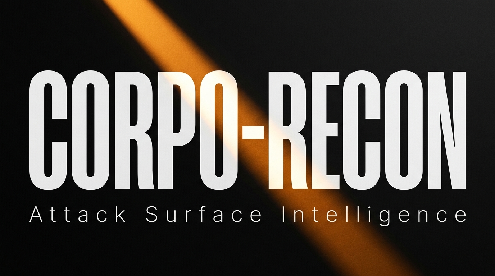

  
    
  
<i>The Billion-Dollar Attack Surface Management (ASM) & Financial Risk Engine</i>

   
  
  &nbsp;
  
  &nbsp;
  
    
  <code>Executive Risk Scoring. Zero-Day Typosquatting. Deep Web Intelligence.</code>

  <b>Advanced Attack Surface Management (ASM)</b> &bull; <b>Open-Source Intelligence (OSINT)</b> &bull; <b>Continuous Threat Exposure Management (CTEM)</b> 
  <i>Empowering red teams, bug bounty hunters, and C-Suite risk analysts with clinical precision, dark web telemetry, and SEC financial reconnaissance.</i>

 

---

 

## SYSTEM OVERVIEW

**Corpo-Recon** is not just another reconnaissance tool. It is an **Enterprise-Grade Attack Surface Management (ASM)** platform engineered to rival $100M+ industry giants. Built for elite red teams, security researchers, and C-Suite financial risk analysts, it seamlessly combines offensive network scanning with dark web telemetry and real-time SEC financial data to generate a cohesive, AI-driven risk narrative.

The interface is strictly functional and monochromatic. No chaotic hex dumps or scrolling waterfalls of unreadable data. Every operation is structured as a sequential telemetry log, executing with clinical precision.

At the conclusion of a scan, Corpo-Recon generates a **Palantir-style Executive HTML Dashboard** featuring physics-based interactive topology graphs and real-time financial market data.

> *"No noise. No clutter. Just structured, actionable intelligence delivered with clinical precision."*

 

---

 

  
   
  Deep Scan execution against <code>acme-corp.com</code> — all 12 modules online, 22 operations complete.

 

---

 

## 💎 The "Billion Dollar" Feature Stack

The execution pipeline is composed of highly specialized, isolated engines that map every dimension of the target organization's operational and financial footprint.

### 1. 🕷️ Trap Buster Asynchronous Fuzzer
A proprietary auto-calibrating fuzzer built on `aiohttp` that detects deceptive WAF responses (e.g., wildcard 200 OKs) and automatically filters out honeypot traps to ensure zero false positives during directory brute-forcing.

### 2. ☢️ Nuclei Automated Vulnerability Engine
Fully integrates ProjectDiscovery's Nuclei. Automates binary management, continuous template fetching, and deep vulnerability scanning against discovered assets without requiring external configuration.

### 3. 🌐 Palantir-Style Topology Visualizer
Automatically generates an ultra-premium, interactive offline HTML dashboard rendering a force-directed graph of the corporate infrastructure alongside SEC financial data.

### 4. 💰 Financial & SEC Risk Engine
Queries Yahoo Finance and SEC EDGAR databases in real-time to pull stock prices, market capitalization, EBITDA, and regulatory anomaly detection, synthesizing it into a Composite Risk Score.

### 5. 🧅 Dark Web Threat Intel
Connects autonomously to Tor relays to execute deep-sweeps across `.onion` directories, detecting leaked credentials, ransomware affiliate negotiations, and compromised API keys.

 

## CORE ARCHITECTURE

| ID | Module | Execution Protocol | Scan Mode |
|:---:|:---|:---|:---:|
| **01** | **Kernel Sandbox** | Initializes an isolated, ephemeral execution environment. | `SURFACE` `DEEP` |
| **02** | **Threat Intel DB** | Establishes encrypted connections to synchronize adversarial signatures. | `SURFACE` `DEEP` |
| **03** | **DNS Recon Engine** | Executes full nameserver resolution, zone transfer assessment (AXFR). | `SURFACE` `DEEP` |
| **04** | **Email Intelligence**| Probes mail exchangers via SMTP and validates DKIM/DMARC alignment. | `SURFACE` `DEEP` |
| **05** | **OSINT Pipelines** | Automates the scraping of public records and corporate registries. | `SURFACE` `DEEP` |
| **06** | **Network Scanner** | Performs stealthy port scanning and analyzes SSL/TLS certificates. | `SURFACE` `DEEP` |
| **07** | **Trap Buster Fuzzer**| Asynchronous engine with honeypot detection to map hidden endpoints. | `SURFACE` `DEEP` |
| **08** | **Nuclei Vuln Engine**| Automates ProjectDiscovery's Nuclei for deep vulnerability correlation. | `SURFACE` `DEEP` |
| **09** | **AI Report Gen**| Leverages Gemini API to compile telemetry into an executive brief. | `SURFACE` `DEEP` |
| **10** | **Topology Visualizer**| Generates a Palantir-style HTML force-graph of the corporate infrastructure. | `SURFACE` `DEEP` |
| **11** | **Dark Web Index** | Connects autonomously to Tor relays and executes deep-sweeps across `.onion`. | `DEEP` only |
| **12** | **Financial Engine** | Fetches real-time stock data and SEC EDGAR anomalies. | `DEEP` only |

> **Note:** The `Dark Web Index` and `Financial Engine` modules remain on `STANDBY` during a Surface Scan. They are activated exclusively by the `--deep-scan` flag.

 

---

 

## DEPLOYMENT & EXECUTION

### Prerequisites

[ SYSTEM TERMINAL ]
> git clone https://github.com/Kurosyss/corpo-recon.git
> cd corpo-recon
> python -m venv venv
> source venv/bin/activate        # macOS / Linux (WSL)
> venv\Scripts\activate           # Windows
> pip install -r requirements.txt
> cp .env.example .env

 

### Surface Scan Protocol
Executes passive reconnaissance — OSINT, DNS enumeration, email intelligence, asynchronous fuzzing, and network perimeter mapping.

[ CORPO-RECON :: SURFACE ]
> python main.py -t target-corp.com

 

### Deep Scan Protocol
Engages the complete enterprise suite. The `--deep-scan` flag explicitly authorizes connections to Tor relay nodes and initiates live financial anomaly analysis.

[ CORPO-RECON :: DEEP ]
> python main.py -t target-corp.com --deep-scan --ai-report

 

## LEAD ARCHITECT

**Corpo-Recon** is conceptualized, designed, and maintained by **Kurosyss (Piyush)**. 

* **Cybersecurity & OSINT Researcher**
* [GitHub Profile](https://github.com/Kurosyss)

*For professional inquiries, VC pitches, security audits, or M&A risk evaluations, reach out via direct channels.*

## LEGAL & OPERATIONAL DISCLAIMER

This software is intended **strictly** for authorized security auditing, defensive threat research, and corporate risk analysis conducted under explicit written authorization. 

The developers and contributors of Corpo-Recon assume **no liability** for misuse, unauthorized deployment, or any damages arising from the operation of this tool. Engaging in unauthorized reconnaissance is **strictly prohibited** and may constitute a criminal offense.
